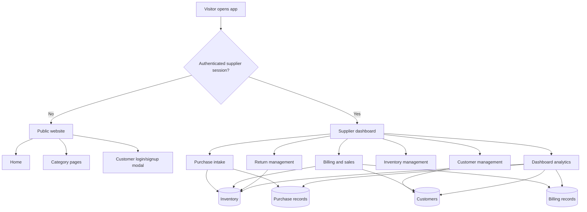

# Nayan Eye Care Project Flow

This document explains how the whole `opencode` project is meant to work end to end, based on the connected system diagram plus the current React codebase, services, and supporting docs.

The project is not a generic e-commerce app. It is an eyewear retail and supplier management system with two major sides:

- Public customer-facing catalog pages
- A protected supplier/staff operating panel used for purchase, billing, inventory, customers, returns, and reporting
## 1. System Goal

The intended business loop is:

1. Products are purchased from vendors or suppliers.
2. Those purchases increase central inventory.
3. Staff create bills for customers from available inventory.
4. Sales reduce inventory and update customer history.
5. Sales returns and purchase returns adjust inventory in the opposite direction.
6. The dashboard reads the live operational data and shows branch-wise and category-wise business performance.

Inventory is the center of the system. Almost every major workflow should either add to stock, remove from stock, or report on stock-driven business activity.

## 2. Main Actors

### Visitor / Customer

- Lands on the public site
- Browses product categories
- Can view the brand and catalog experience
- In the full target flow, should also be able to log in, view records, and place or track requests

### Supplier / Staff User

- Logs in through the header modal
- Enters purchases
- Creates bills
- Manages customers
- Reviews inventory
- Handles returns
- Uses dashboard analytics

### Backend + Data Layer

- Spring Boot APIs are the operational source of truth
- H2 database stores structured entities
- JSON files in `data/` act as backup or snapshot inputs for some flows
- `localStorage` and `sessionStorage` are currently used as temporary fallbacks in some modules

## 3. Top-Level Project Flow

## 4. Routing and Entry Flow

The app starts in `src/App.tsx`.

Current routing pattern:

- `/` shows the public home page unless a supplier session exists
- supplier sessions redirect to `/supplier/dashboard`
- supplier pages are protected through `ProtectedRoute`
- public category pages are:
  - `/spectacles`
  - `/sunglasses`
  - `/contact-lenses`
  - `/frames`
  - `/solutions`

Auth is coordinated through:

- `src/components/Header.tsx`
- `src/components/LoginModal.tsx`
- `src/services/authService.ts`

Expected auth flow:

1. User opens the app.
2. `authService.isAuthenticated()` checks session state.
3. If the user is a supplier, route them into the protected supplier panel.
4. If not authenticated, keep them on the public site.
5. Login/signup should eventually be backed by real backend auth for both supplier and customer roles.

Current implementation note:

- supplier login works through a mock-first flow in `authService.ts`
- auth state is kept in `sessionStorage`
- customer-facing account flow is not yet a complete working portal

## 5. Public Website Flow

The public site is mainly a presentation and discovery layer.

Current public flow:

1. User lands on `Home.tsx`.
2. They browse categories and featured products.
3. They can open login/signup from the header.
4. Real product purchase is still completed through the supplier billing workflow rather than an end-to-end online checkout flow.

How this side should work in the final system:

1. Browse live inventory-backed catalog data.
2. Register or log in as a customer.
3. Save prescription details or booking requests.
4. View bills, purchase history, and returns.
5. Connect smoothly into offline walk-in billing and future online order journeys.

## 6. Supplier Operations Flow

The supplier panel is the true operational core of the project.

### 6.1 Dashboard

Route: `/supplier/dashboard`

Purpose:

- Show business summary
- Track revenue, purchases, profit, customers, category mix, and branch performance

How it should work:

1. Read live purchase, billing, customer, inventory, and return data.
2. Aggregate by date range and branch.
3. Calculate revenue, COGS, gross profit, net profit, and stock alerts.
4. Surface low-stock and action-needed items.

Current implementation note:

- `dashboardService.ts` still reads JSON files under `data/`
- this means analytics can lag behind the live backend database

### 6.2 Purchase Intake
