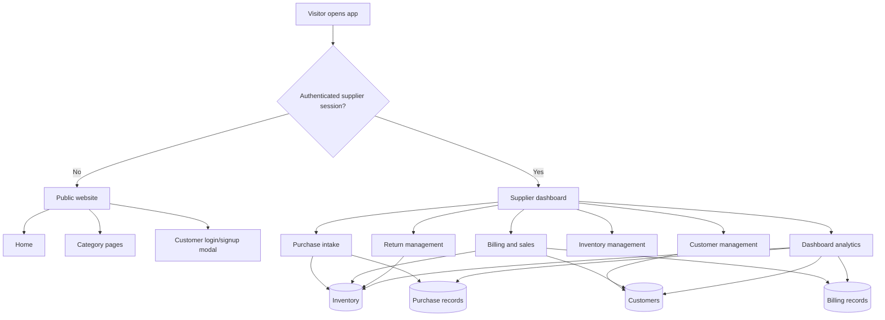

# Nayan Eye Care Project Flow

This document explains how the whole `opencode` project is meant to work end to end, based on the connected system diagram plus the current React codebase, services, and supporting docs.

The project is not a generic e-commerce app. It is an eyewear retail and supplier management system with two major sides:

- Public customer-facing catalog pages
- A protected supplier/staff operating panel used for purchase, billing, inventory, customers, returns, and reporting
## 1. System Goal

The intended business loop is:

1. Products are purchased from vendors or suppliers.
2. Those purchases increase central inventory.
3. Staff create bills for customers from available inventory.
4. Sales reduce inventory and update customer history.
5. Sales returns and purchase returns adjust inventory in the opposite direction.
6. The dashboard reads the live operational data and shows branch-wise and category-wise business performance.

Inventory is the center of the system. Almost every major workflow should either add to stock, remove from stock, or report on stock-driven business activity.

## 2. Main Actors

### Visitor / Customer

- Lands on the public site
- Browses product categories
- Can view the brand and catalog experience
- In the full target flow, should also be able to log in, view records, and place or track requests

### Supplier / Staff User

- Logs in through the header modal
- Enters purchases
- Creates bills
- Manages customers
- Reviews inventory
- Handles returns
- Uses dashboard analytics

### Backend + Data Layer

- Spring Boot APIs are the operational source of truth
- H2 database stores structured entities
- JSON files in `data/` act as backup or snapshot inputs for some flows
- `localStorage` and `sessionStorage` are currently used as temporary fallbacks in some modules

## 3. Top-Level Project Flow

## 4. Routing and Entry Flow
