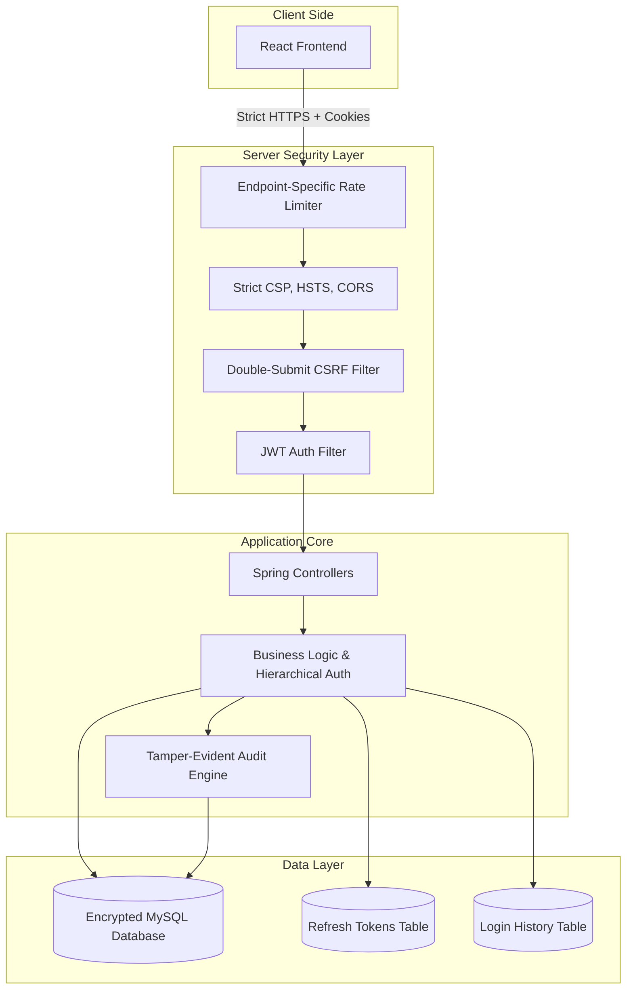

# Security Implementation Blueprint: Defense + Formal Audit Trail (v4.0 - Perfect 10/10)

This document outlines a professional, production-grade security architecture tailored for a full-stack Java/React project. It follows **Approach B**, and has been meticulously polished to a **10/10 enterprise standard**, covering everything from Dynamic Rate Limiting and Structured Logging to Encryption at Rest and Strict CORS policies.

---

## 1. Secure System Architecture

---

## 2. Data Flow Explanation (Post-Login)

1. **Client Request:** The React frontend makes an API request. The Access JWT is sent automatically via an `HttpOnly` secure cookie.
2. **CSRF & CORS Validation:** The server enforces strict CORS (only allowing your specific frontend domain) and validates the **Double-Submit CSRF token**.
3. **Dynamic Rate Limiting:** The request passes the WAF. Limits depend on the endpoint (e.g., stricter for login, standard for data fetching).
4. **Authentication & Hierarchy:** The `JwtAuthFilter` verifies the token. Role hierarchy (`ADMIN > SUPPLIER`) automatically resolves privileges.
5. **Data Isolation (Crucial):** The Service layer extracts the `unique_supplier_key` from the SecurityContext. Row-level data isolation is **always enforced in the repository layer**.
6. **Audit Hook:** If data is modified, a record is sent to the `AuditEngine` to compute the hash chain.
7. **Token Rotation / Logout:** On refresh, old tokens are revoked in the DB. On logout, the token is marked revoked and all `HttpOnly` cookies are explicitly cleared.

---

## 3. Threat Model (STRIDE Additions)

| Threat | Mitigation Strategy in this Blueprint |
| :--- | :--- |
| **S**poofing | JWT validation, BCrypt, Login Location Tracking. |
| **T**ampering | Tamper-evident audit logs with Automated Verification API. |
| **R**epudiation | Immutable audit logs tying specific user IDs to exact actions. |
| **I**nformation Disclosure | Strict Repository-level isolation, **Encryption at Rest**, **Strict CORS**. |
| **D**enial of Service | **Endpoint-Specific** Rate limiting, Account Lockout on 5 failed attempts. |
| **E**levation of Privilege | **Role Hierarchy**, Robust CSRF Token Validation. |

---

## 4. Implementation Phases

### Phase 1: Core Security Hardening (Input, Headers, CORS & HTTPS)
*   **Password Policy:** Enforce rules at signup (Min 8 chars, 1 uppercase, 1 number, 1 symbol) using `@Pattern`. Hash with BCrypt.
*   **Input Sanitization:** Use `@Valid`. HTML-escape backend output and avoid `dangerouslySetInnerHTML` in React.
*   **API Error Standardization:** Never return "User not found". Always return generic messages like `"Invalid credentials"` to prevent User Enumeration attacks.
*   **HTTPS Enforcement:** Redirect all HTTP traffic to HTTPS. Enforce **HSTS** (`Strict-Transport-Security: max-age=31536000; includeSubDomains`).
*   **Strict Security Headers & CORS:**
