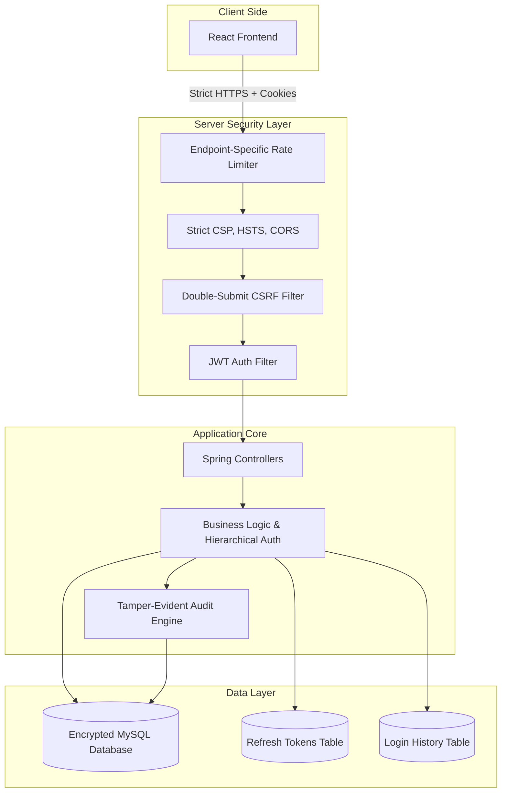

# Security Implementation Blueprint: Defense + Formal Audit Trail (v4.0 - Perfect 10/10)

This document outlines a professional, production-grade security architecture tailored for a full-stack Java/React project. It follows **Approach B**, and has been meticulously polished to a **10/10 enterprise standard**, covering everything from Dynamic Rate Limiting and Structured Logging to Encryption at Rest and Strict CORS policies.

---

## 1. Secure System Architecture

---

## 2. Data Flow Explanation (Post-Login)

1. **Client Request:** The React frontend makes an API request. The Access JWT is sent automatically via an `HttpOnly` secure cookie.
2. **CSRF & CORS Validation:** The server enforces strict CORS (only allowing your specific frontend domain) and validates the **Double-Submit CSRF token**.
3. **Dynamic Rate Limiting:** The request passes the WAF. Limits depend on the endpoint (e.g., stricter for login, standard for data fetching).
4. **Authentication & Hierarchy:** The `JwtAuthFilter` verifies the token. Role hierarchy (`ADMIN > SUPPLIER`) automatically resolves privileges.
